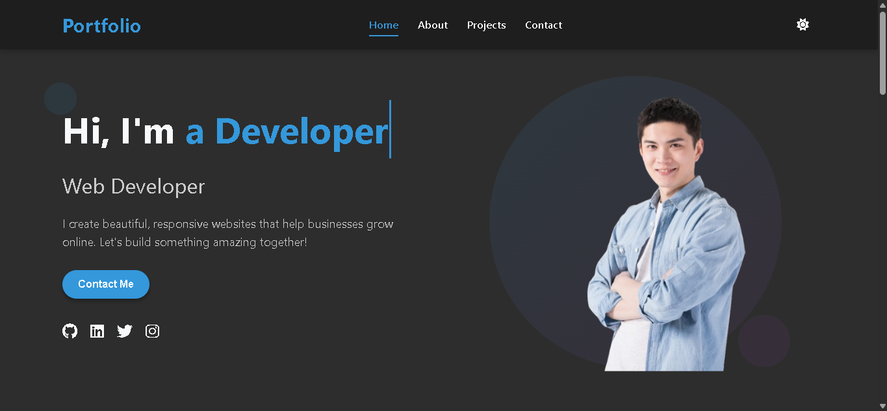
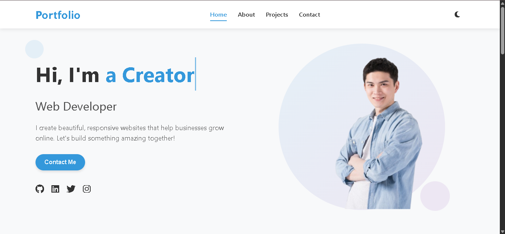

# Modern Responsive Portfolio Website

 
 

A sleek, fully responsive portfolio website with dark mode, smooth animations, and interactive elements. Built with HTML5, CSS3, and JavaScript.

## ✨ Features

- **Responsive Design**: Perfectly adapts to all screen sizes
- **Dark/Light Mode**: Toggle with system preference detection
- **Interactive Elements**:
  - Typing animation for hero section
  - Smooth scroll animations
  - Project card hover effects
- **Modern UI Components**:
  - Animated navigation bar
  - Scroll progress indicator
  - Back-to-top button
  - Form input animations
- **Performance Optimized**:
  - Efficient animations using Intersection Observer
  - Minimal dependencies
- **Accessibility Focused**:
  - Proper contrast ratios
  - Semantic HTML
  - Keyboard navigable

## 🛠️ Technologies Used

- HTML5 (semantic markup)
- CSS3 (variables, animations, flexbox, grid)
- JavaScript (ES6+)
- Font Awesome (icons)
- Google Fonts (optional)

## 🚀 Installation & Setup

1. **Clone the repository**:
   ```bash
   git clone https://github.com/OssamaAgourari/ResponsiveDeveloperPortfolio
   cd ResponsiveDeveloperPortfolio
